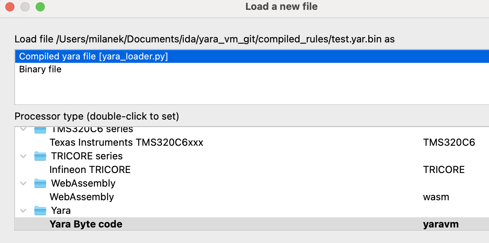
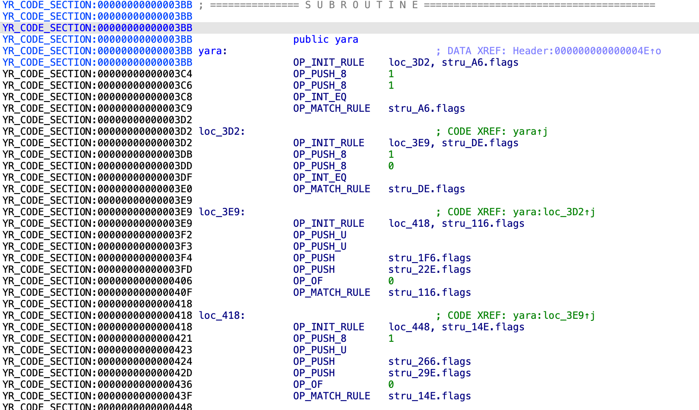
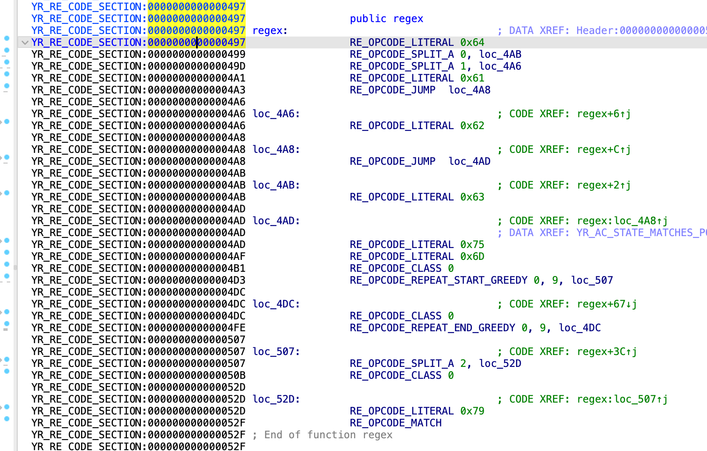

# YaraVM
[Yara](https://github.com/VirusTotal/yara) is a tool for matching patterns in files, commonly used for malware analysis. Yara rules can be compiled into a binary format that can later be loaded and executed. This repository contains a processor module and a loader for IDA Pro, enabling you to load and analyze compiled Yara rules.


## Installation

To install the YaraVM into IDA, follow these steps:

1. Copy the `yara_loader.py` file to the IDA `loaders` folder.
2. Copy the `yara_proc.py` file to the IDA `proc` folder.
3. Copy the `libyara.til` file to the IDA `til` folder.
4. Now you can open the compiled yara rules in IDA.


For convenience, you can use the following commands to create the necessary symlinks:
```zsh
mkdir -p ~/.idapro/loaders
mkdir -p ~/.idapro/procs
mkdir -p ~/.idapro/til

ln -s $PWD/src/yara_loader.py ~/.idapro/loaders/yara_loader.py
ln -s $PWD/src/yara_proc.py ~/.idapro/procs/yara_proc.py
ln -s $PWD/src/libyara.til ~/.idapro/til/libyara.til
```

## Demonstration
You can load the file [test.yar.bin](compiled_rules/test.yar.bin) into IDA Pro to see the Yara bytecode and the regex bytecode.



